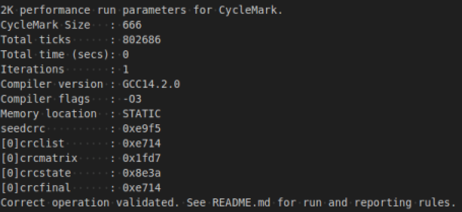

# CycleMark Benchmarking

This document explains what **CycleMark** is and how it is used in this project to measure the performance of a **RISC-V** core.

 
 

---

 
 
 
 
 

## What is CycleMark?

**CycleMark** is based on **CoreMark**, a synthetic benchmark designed to evaluate the performance of microcontroller-class processors. It consists of several computational workloads, such as list processing, matrix manipulation, and state machine handling, which are representative of typical embedded software.

However, the **Embedded Microprocessor Benchmark Consortium (EEMBC)** does not allow modified CoreMark source code to be reported as an official “CoreMark” result. This rule ensures consistency and comparability between official CoreMark implementations.

In this project, several changes were made to make the benchmark compatible with even simple educational RISC-V cores:

- Performance is measured using the `mcycle` CSR, which counts the number of clock cycles required to execute the selected number of benchmark iterations.
- Output functions used to print the benchmark results were adapted to the available firmware environment.

As a result, **CycleMark** is functionally close to **CoreMark**, but it is **not an official CoreMark score**.

Nonetheless, **CycleMark** remains useful for comparing the relative performance of different **CPU** designs within this project.

 
 

### CycleMark results

In this project, **CycleMark** is used to evaluate how efficiently a **RISC-V** core executes the CoreMark workload by measuring the number of clock cycles required to complete the benchmark.

The benchmark result is converted into a **CycleMark/MHz** value:

`CycleMark/MHz = Iterations / (Total ticks / 1e6)`

This value represents how many benchmark iterations can be completed per million clock cycles.

A higher **CycleMark/MHz** value means that the core completes more work for the same number of clock cycles. It is therefore a useful performance-per-MHz indicator.

When combined with the maximum frequency reported by an FPGA implementation tool, the **CycleMark/MHz** value can be used to estimate the practical performance of the core on hardware:

`Estimated CycleMark/s = CycleMark/MHz × Fmax_MHz`

This combines both:
- the architectural efficiency of the processor,
- and the maximum operating frequency achieved on the FPGA.

 
 

---

 
 
 
 
 

## How to Run CycleMark

To execute the **CycleMark** benchmark, see the [Simulation Environment](../../../simulation/README.md) documentation.

The default **CycleMark** configuration is used.

> ⚠️ The **CycleMark** simulation may take a significant amount of time. Please do not interrupt it until it completes normally or times out.

 
 

---

 
 
 
 
 

## CycleMark log

Once **CycleMark** has been executed, the log files are saved in the **work/cyclemark/log** directory.

Below is an example of a **CycleMark** log output:

This log provides useful information about the configuration and execution of the **CycleMark** benchmark.

The most important value is **Total ticks**, which represents the number of clock cycles required to complete the selected number of benchmark iterations.

Although **CycleMark** is not an official **CoreMark** result, it still uses the CoreMark workload as its basis.

To estimate performance in a way similar to traditional CoreMark-style reporting, the following formula is used:

`CycleMark/MHz = Iterations / (Total ticks / 1e6)`

For example, if the benchmark completes **1** iteration in **802686** cycles:

`CycleMark/MHz = 1 / (802686 / 1e6) = 1.24`

This means that the core can execute approximately **1.24 benchmark iterations per million clock cycles**.

The scaling factor **1e6** is used to normalize the result to one megahertz.

 
 

---
